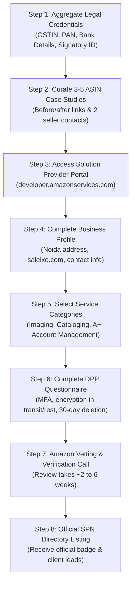

# Amazon Service Provider Network (SPN) & Solution Provider Portal (SPP) Qualification Guide

A comprehensive guide and checklist for **Saleixo** to qualify, apply, and get listed as an official service provider on Amazon Seller Central.

---

## 1. Executive Summary

- **What is Amazon SPN?** The Amazon Service Provider Network is Amazon's official directory in Seller Central where millions of third-party sellers discover and hire vetted agencies for photography, cataloging, A+ content, advertising, and account management.
- **What is SPP?** The Solution Provider Portal (`developer.amazonservices.com`) is the platform where service providers apply, undergo vetting, manage listings, and handle Seller Central API authorizations.
- **Saleixo Status:** High readiness. The public website, legal policies (DPP/AUP-compliant privacy policy), and service tiers are already built and deployed. The remaining steps are document aggregation, client references, and portal submission.

---

## 2. Eligibility & Requirements Checklist

### A. Legal & Business Entity (India)
| Document / Requirement | Details | Status |
| :--- | :--- | :--- |
| **Registered Business Entity** | Pvt Ltd, LLP, or Registered Sole Proprietorship/Partnership in India. | Required for application |
| **GSTIN Certificate** | Active GST registration in Uttar Pradesh (Noida address). | Required |
| **PAN Card** | Company PAN or Proprietor PAN card. | Required |
| **Business Bank Account** | Active current account matching the registered legal name. | Required |
| **Authorized Signatory ID** | Government photo ID (Passport, Aadhaar, Voter ID) of primary applicant. | Required |
| **Amazon Professional Account** | Seller or Developer account with Multi-Factor Authentication (MFA) enabled. | Required to access portal |

### B. Website & Technical Readiness (`saleixo.com`)
| Requirement | Standard | Saleixo Status |
| :--- | :--- | :--- |
| **Live Secure Domain** | HTTPS with TLS 1.2+, strict-origin headers, valid SSL certificate. | **Completed** |
| **Physical Address & Contact** | Exact match with Google Business Profile & registration docs. | **Completed** (Noida Sector 62) |
| **Amazon SP-API Privacy Policy** | Specific clauses detailing Selling Partner data use, non-resale, and 30-day deletion. | **Completed** (`/privacy` Sec 9–14) |
| **Terms of Service & Refund Policy** | Clear client agreements, dispute resolution, cancellation terms. | **Completed** (`/terms`, `/refund`) |
| **Transparent Services & Pricing** | Defined deliverables, à-la-carte menus, and scope definitions. | **Completed** (`/services/amazon`, `/custom-pricing`) |
| **No Unverified Claims** | Strict avoidance of premature "Official SPN Partner" badges before approval. | **Completed** |

### C. Track Record & Client References
Amazon manually reviews and verifies your past performance:
- **3 to 5 Live Amazon ASINs:** Prepare direct links showing Saleixo's photography, A+ content, or listing optimization.
- **2 to 3 Contactable Seller References:** Amazon's onboarding team may email or call references to confirm quality, punctuality, and professionalism.
- **Published Service Level Agreements (SLAs):** Turnaround times clearly stated (e.g. 48–72 hr photo delivery, 5-day campaign launch).

---

## 3. Recommended Service Categories for Saleixo

When registering in the portal, select the categories that align with Saleixo's strengths:

1. **Imaging (Product Photography):**
   - Pure white background packshots (RGB 255, 255, 255, 1600+ px, 85%+ fill).
   - Lifestyle, scale, and infographic photography.
2. **Cataloging & Listing Creation:**
   - Title structure, 5 bullet points, backend search terms, category style guide compliance.
3. **Enhanced Brand Content / A+ Content & Brand Stores:**
   - Standard & Premium A+ modules, brand story banners, mobile layout optimization.
4. **Account Management:**
   - Seller onboarding, catalog health, account health rating (AHR) management.
5. **Advertising Optimization (Amazon PPC):**
   - Sponsored Products, Sponsored Brands, Sponsored Display campaign setup and optimization.

---

## 4. Step-by-Step Application Roadmap

---

## 5. Answers to Amazon's Data Protection Policy (DPP) Assessment

When prompted for security and data privacy questions in the portal:
1. **Data Encryption:** All data in transit is encrypted using TLS 1.2 or higher. Data at rest is encrypted using AES-256.
2. **Access Controls & MFA:** Access to client seller accounts is restricted to authorized personnel under least-privilege principles with Multi-Factor Authentication (MFA) mandatory.
3. **Data Retention & Disposal:** Amazon Selling Partner data is stored only for active service fulfillment. Transaction data is deleted within 90 days of project conclusion, and full account data is purged within 30 days upon client request, as published in Section 12 of `saleixo.com/privacy`.
4. **No Third-Party Sharing:** Client seller data is never sold, shared, or used for third-party advertising or profiling.

---

## 6. Maintenance & Performance After Approval

Once listed in the directory:
- Maintain a minimum 4.0+ rating from client reviews on Seller Central.
- Respond to incoming seller inquiries within 24 hours.
- Adhere strictly to Amazon's communication and fee transaction guidelines.
